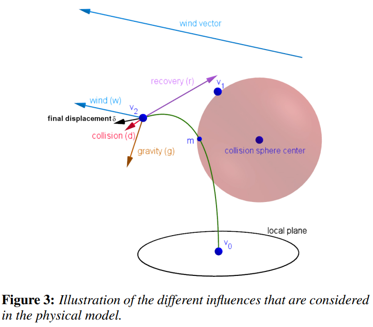

Vulkan Grass Rendering
========================

## Features

- Represent grass as Bezier curves

  

- Simulate forces with gravity, recovery and wind.

  

- Cull the blade when the front face direction is perpendicular to the view vector and when blades are outside of the view-frustum.

- Tessellate to varying levels of detail as a function of how far the grass blade is from the camera.

## References

* [Responsive Real-Time Grass Grass Rendering for General 3D Scenes](https://www.cg.tuwien.ac.at/research/publications/2017/JAHRMANN-2017-RRTG/JAHRMANN-2017-RRTG-draft.pdf)
* [Vulkan tutorial](https://vulkan-tutorial.com/)
* [RenderDoc blog on Vulkan](https://renderdoc.org/vulkan-in-30-minutes.html)
* [Tessellation tutorial](http://ogldev.atspace.co.uk/www/tutorial30/tutorial30.html)
* [CIS 565 Vulkan Samples](https://github.com/CIS565-Fall-2017/Vulkan-Samples#cis-565-vulkan-samples)
